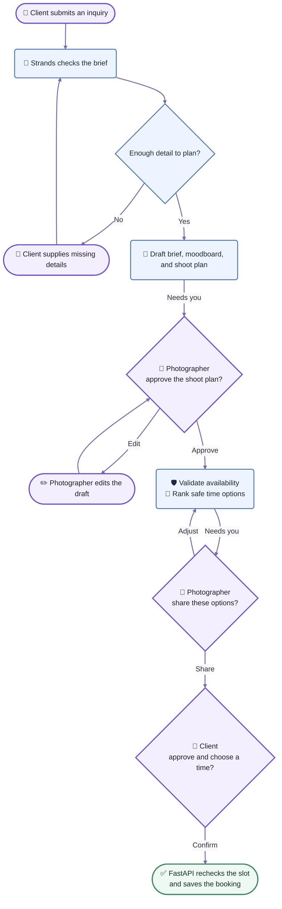
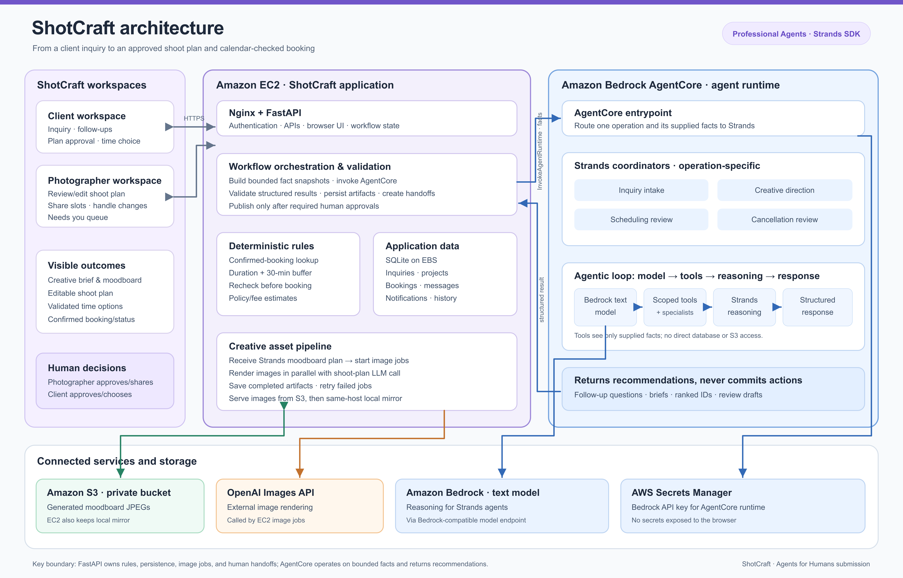
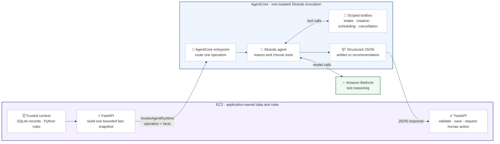
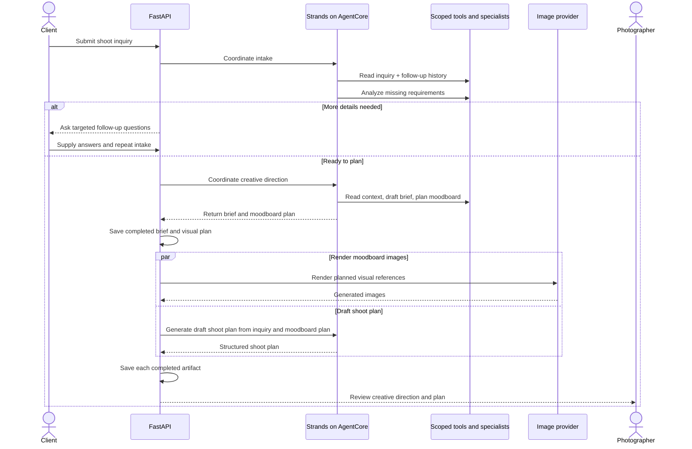
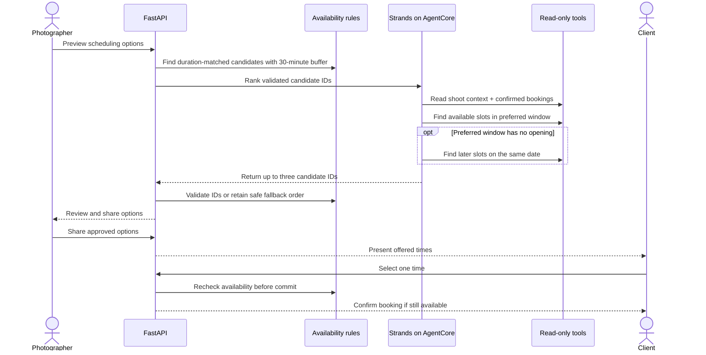

<p align="center">
  
</p>

# ShotCraft

### From “I have a photoshoot idea” to “we’re booked.”

ShotCraft is an AI-assisted workspace for independent photographers and their clients. It turns a shoot inquiry into a creative brief, visual moodboard, editable shoot plan, and calendar-checked time options. The agent handles the preparation; people decide what to share, approve, schedule, or cancel.

Built for the [Agents for Humans Hackathon](https://agentsforhumans.devpost.com/) · **Professional Agents** track · Powered by the [Strands Agents SDK](https://strandsagents.com/)

**Try it:** [Live ShotCraft app](https://shotcraft.online/) · [Architecture diagram](docs/architecture/architecture.png) · [Build story on AWS Builder Center](https://builder.aws.com/content/3JKwMR0xzcjZrvAxq45FBn6AKU2/agents-for-humans-building-shotcraft-with-strands-agents-and-amazon-bedrock)

**Explore the repo:** [How it works](#one-inquiry-one-coordinated-workflow) · [Human decisions](#the-human-decision-boundary) · [Architecture](#architecture) · [Try the hosted app](#try-the-hosted-app) · [Run locally](#run-locally)

## Why this exists

Planning a photoshoot often means piecing together a client's ideas, missing details, visual references, deliverables, availability, and last-minute changes across forms and messages. ShotCraft gives the photographer one prepared starting point and gives the client a clear path from idea to confirmed shoot.

This is a workflow tool, not a chatbot that books on someone's behalf. Its purpose is to reduce repetitive preparation **without hiding consequential choices from either person**. We have not measured a time-savings figure; the demo shows the work the agent takes on and the decisions it leaves to humans.

## One inquiry, one coordinated workflow

| Moment                            | ShotCraft prepares                                                                                                               | A person decides                                                                    |
| --------------------------------- | -------------------------------------------------------------------------------------------------------------------------------- | ----------------------------------------------------------------------------------- |
| **1 · Inquiry**            | Reads the client's concept, budget, date, duration, and preferences; asks targeted follow-up questions when details are missing. | The client supplies the missing information.                                        |
| **2 · Creative direction** | Builds a brief and moodboard plan, renders visual references with a separate image provider, and drafts a shoot plan.            | The photographer reviews and edits the plan.                                        |
| **3 · Scheduling**         | Checks confirmed bookings, finds duration-matched openings, and ranks up to three validated options.                             | The photographer shares options; the client chooses a time and approves the plan.   |
| **4 · Changes**            | Rechecks availability for a new date or time; gathers booking, policy, and project facts for a cancellation review.              | The photographer approves or declines a cancellation, or messages the client first. |

### One journey, three human decision gates



Blue steps are agent preparation, purple steps are human inputs or decisions, and green is the deterministic commit. The workflow pauses at each **Needs you** handoff; no plan is shared and no booking is committed autonomously.

The two workspaces show project progress, messages, notifications, and a **Needs you** queue for outstanding decisions. Ordinary messages stay in Messages rather than being duplicated as workflow notifications.

### The human decision boundary

Strands agents use scoped tools to gather facts and recommend next steps. They do **not** invent available times, send a plan, confirm a booking, calculate or collect a cancellation fee, or cancel a shoot themselves.

- **Scheduling:** Python checks confirmed shoots with a 30-minute buffer. An agent may rank only the candidate slots returned by the availability tool. The chosen slot is checked again before confirmation. If the preferred window is full, the app looks later on the same date and labels those options; if no suitable slot exists, it asks for another date.
- **Cancellation:** The agent reads the confirmed booking, accepted policy, client request, and project history before suggesting an action and an editable message. Fee and refund estimates come from server-side policy rules—not the model. A request remains pending until the photographer makes a decision.
- **Fallbacks:** If agent ranking is unavailable, the photographer can still review deterministic, calendar-checked options. If image generation stops, the saved brief can be used to retry the moodboard.

The application shows fee and refund **estimates**; it does not process payments or issue refunds.

## Architecture

The architecture diagram shows the browser workspaces, EC2 application, AgentCore runtime, AWS services, external image provider, and the human decision boundary. The AgentCore zoom-in below adds detail about its tools and handoff to FastAPI.



### Inside the AgentCore boundary

This zoom-in shows the key handoff. **FastAPI reads the database and calculates availability or policy amounts.** It sends only the facts needed for one operation. The AgentCore entrypoint selects the corresponding Strands agent; that agent calls tools scoped to the received JSON, uses Bedrock for text reasoning, and returns structured results. FastAPI owns validation, persistence, and any human handoff.



Each AgentCore request runs **one scoped Strands workflow**:

| Workflow | What the agent reviews | What it returns |
| --- | --- | --- |
| Inquiry intake | Inquiry and follow-up answers | Missing details or a ready-to-plan assessment |
| Creative direction | Completed inquiry and creative context | Editable brief and moodboard plan |
| Scheduling review | Shoot details and server-validated openings | Ranked IDs of available options |
| Cancellation review | Booking, client request, and server-calculated policy facts | Recommendation and editable message |

**Where decisions live:** The browser talks to FastAPI on EC2. FastAPI reads SQLite, calculates availability and policy estimates, and sends a bounded fact snapshot to AgentCore. Strands uses scoped tools and Amazon Bedrock for text reasoning, then returns structured results for FastAPI to validate. The agent cannot directly change bookings, send messages, or access the database. A separate, tool-free Strands operation handles some structured drafting.

**Where images live:** Strands produces the moodboard *plan*; a background job on EC2 calls the OpenAI Images API to render it. FastAPI stores generated images in private S3 and a local mirror, serving the local copy if S3 is unavailable.

### Flow 1 · From inquiry to an editable shoot plan

The **intake coordinator** reads the inquiry and prior answers before calling its requirements-analysis tool. If details are missing, the client answers targeted questions and intake runs again. Once the brief is complete, the **creative coordinator** calls its brief and moodboard specialist tools in order; the app saves each artifact as it arrives.



Strands plans the visual direction; **image rendering is a separate provider call**. Neither the coordinator nor the image provider publishes the shoot plan to the client.

### Flow 2 · From safe options to a confirmed booking

The **scheduling coordinator** must inspect shoot context and confirmed bookings, then call the availability tool for the preferred window. It may inspect later openings on the same date only if that window is empty. Its output is a ranking of existing option IDs—not invented times.



For a time change, the same checks also read the existing booking and prior preference rounds; the original booking stays protected until a client-approved replacement passes the final recheck. If agent ranking fails, the photographer sees deterministic, conflict-checked options instead.

The two sequence diagrams show the deployed AgentCore path. Local Strands uses the same human decision boundaries.

## Try the hosted app

Open [shotcraft.online](https://shotcraft.online/). You can create your own test accounts; no local installation or pre-issued credentials are needed. Use two browser profiles (or a normal and private window) to keep the roles signed in at the same time.

1. **Create a photographer account** with a city and a password of at least eight characters.
2. **Create a client account.** Select **New inquiry**, choose the same city, then select your photographer from the list. Describe a shoot, choose a date and time window, and submit it.
3. **Complete any follow-up questions** in the client workspace. ShotCraft prepares a brief, visual moodboard, and draft shoot plan; image generation can take a few minutes.
4. **Switch to the photographer workspace** to review and edit the plan, inspect calendar-checked options, and share the plan and times with the client.
5. **Return as the client** to approve the plan and choose an offered time. ShotCraft rechecks availability before confirming the booking.

To explore the exception flow, request a time change or cancellation as the client and review the pending decision as the photographer. The application shows policy estimates but does not process payments.

## Run locally

You need Python 3.11+, access to the configured [Amazon Bedrock text model and API key](https://docs.aws.amazon.com/bedrock/latest/userguide/api-keys.html), and an OpenAI API key for moodboard images. From the repository root:

```bash
python3.11 -m venv .venv
source .venv/bin/activate
python -m pip install -r requirements.txt
cp .env.example .env
```

Edit `.env` and set these values for local Strands execution:

```dotenv
AWS_REGION=us-west-2
AWS_BEARER_TOKEN_BEDROCK=your_bedrock_api_key
OPENAI_API_KEY=your_openai_api_key
```

The model IDs and image model are already in `.env.example`; use models available to your account and Region if you change them. Comment out the example `AWS_PROFILE=strands-dev` unless that profile exists on your machine. The Bedrock bearer token is required for local text calls; an AWS CLI profile alone does not replace it. Keep `.env` private and never commit credentials.

Start the server, then follow the [hosted-app walkthrough](#try-the-hosted-app) at [http://127.0.0.1:8000](http://127.0.0.1:8000):

```bash
uvicorn app.main:app --reload --host 127.0.0.1 --port 8000
```

S3 is **not required locally**: generated images are saved in `static/generated/`. If you want the local app to invoke a deployed AgentCore runtime, set `SHOTCRAFT_AGENTCORE_ENABLED=true` and `SHOTCRAFT_AGENTCORE_RUNTIME_ARN` in `.env` and provide AWS SDK credentials with permission to invoke it. The [EC2 deployment runbook](deploy/EC2.md) covers the hosted configuration and private S3 storage.

## Verify the implementation

```bash
python -m unittest discover -s tests  # automated workflow and regression tests
python smoke_test.py                  # live Bedrock/Strands credential check
python verify_strands_creative.py     # live creative tool loop; no DB writes or images
python verify_strands_scheduling.py   # live scheduling and conflict checks
```

The automated suite uses temporary SQLite databases and mocked provider calls. Live verifiers should report `agent_used_tools: true`; they may incur model charges. They test tool execution and safe candidate selection, **not** the complete client–photographer approval flow.

## Code map

| Path                                                                                 | What lives there                                         |
| ------------------------------------------------------------------------------------ | -------------------------------------------------------- |
| [`app/agent.py`](app/agent.py)                                                      | Strands agents and tool-using coordination               |
| [`app/main.py`](app/main.py)                                                        | API routes and workflow orchestration                    |
| [`app/storage.py`](app/storage.py)                                                  | SQLite persistence, bookings, notifications, and history |
| [`app/images.py`](app/images.py) · [`app/image_storage.py`](app/image_storage.py) | Moodboard rendering and S3/local image storage           |
| [`static/`](static/)                                                                | Client and photographer workspaces                       |
| [`tests/`](tests/)                                                                  | Workflow and regression tests                            |
