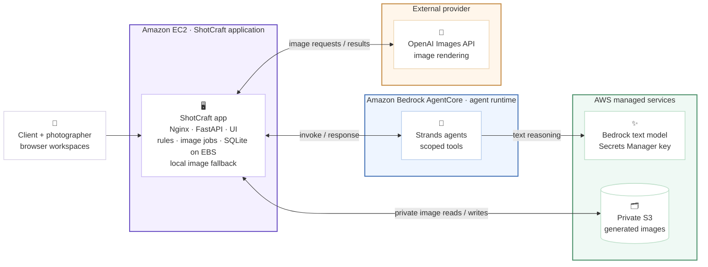
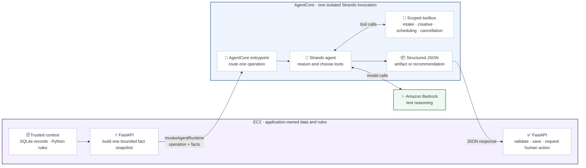
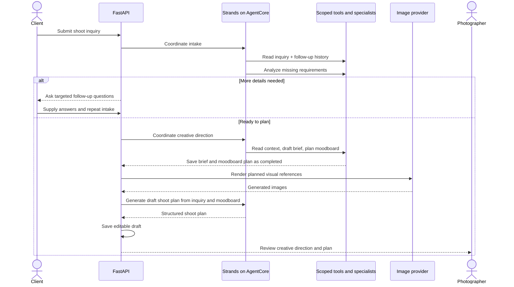
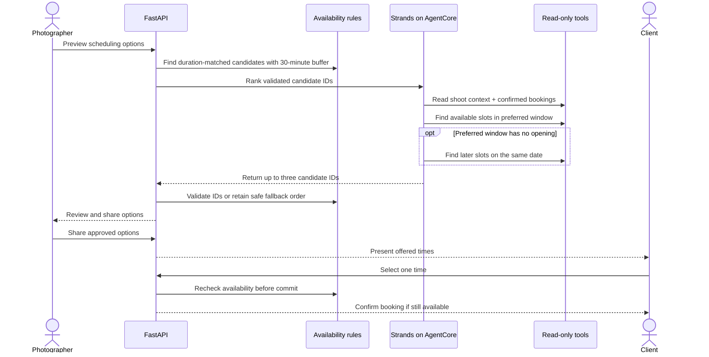

<p align="center">
  
</p>

# ShotCraft

### From “I have a photoshoot idea” to “we’re booked.”

ShotCraft is an AI-assisted workspace for independent photographers and their clients. It turns a shoot inquiry into a creative brief, visual moodboard, editable shoot plan, and calendar-checked time options. The agent handles the preparation; people decide what to share, approve, schedule, or cancel.

Built for the [Agents for Humans Hackathon](https://agentsforhumans.devpost.com/) · **Professional Agents** track · Powered by the [Strands Agents SDK](https://strandsagents.com/)

**Explore:** [How it works](#workflow) · [Human decisions](#human-decisions) · [Architecture](#system-architecture) · [Run locally](#local-setup) · [Judge walkthrough](#judge-demo)

## Why this exists

Planning a photoshoot often means piecing together a client's ideas, missing details, visual references, deliverables, availability, and last-minute changes across forms and messages. ShotCraft gives the photographer one prepared starting point and gives the client a clear path from idea to confirmed shoot.

This is a workflow tool, not a chatbot that books on someone's behalf. Its purpose is to reduce repetitive preparation **without hiding consequential choices from either person**. We have not measured a time-savings figure; the demo shows the work the agent takes on and the decisions it leaves to humans.

<a id="workflow"></a>

## One inquiry, one coordinated workflow

| Moment                            | ShotCraft prepares                                                                                                               | A person decides                                                                    |
| --------------------------------- | -------------------------------------------------------------------------------------------------------------------------------- | ----------------------------------------------------------------------------------- |
| **1 · Inquiry**            | Reads the client's concept, budget, date, duration, and preferences; asks targeted follow-up questions when details are missing. | The client supplies the missing information.                                        |
| **2 · Creative direction** | Builds a brief and moodboard plan, renders visual references with a separate image provider, and drafts a shoot plan.            | The photographer reviews and edits the plan.                                        |
| **3 · Scheduling**         | Checks confirmed bookings, finds duration-matched openings, and ranks up to three validated options.                             | The photographer shares options; the client chooses a time and approves the plan.   |
| **4 · Changes**            | Rechecks availability for a new date or time; gathers booking, policy, and project facts for a cancellation review.              | The photographer approves or declines a cancellation, or messages the client first. |

### One journey, three human decision gates


Blue steps are agent preparation, purple steps are human inputs or decisions, and green is the deterministic commit. The workflow pauses at each **Needs you** handoff; no plan is shared and no booking is committed autonomously.

The two workspaces show project progress, messages, notifications, and a **Needs you** queue for outstanding decisions. Ordinary messages stay in Messages rather than being duplicated as workflow notifications.

<a id="human-decisions"></a>

### The human decision boundary

Strands agents use scoped tools to gather facts and recommend next steps. They do **not** invent available times, send a plan, confirm a booking, calculate or collect a cancellation fee, or cancel a shoot themselves.

- **Scheduling:** Python checks confirmed shoots with a 30-minute buffer. An agent may rank only the candidate slots returned by the availability tool. The chosen slot is checked again before confirmation. If the preferred window is full, the app looks later on the same date and labels those options; if no suitable slot exists, it asks for another date.
- **Cancellation:** The agent reads the confirmed booking, accepted policy, client request, and project history before suggesting an action and an editable message. Fee and refund estimates come from server-side policy rules—not the model. A request remains pending until the photographer makes a decision.
- **Fallbacks:** If agent ranking is unavailable, the photographer can still review deterministic, calendar-checked options. If image generation stops, the saved brief can be used to retry the moodboard.

The application shows fee and refund **estimates**; it does not process payments or issue refunds.

<a id="system-architecture"></a>

## Architecture

This is the deployment at a glance. The colored boxes show **where each component lives**; the AgentCore zoom-in below shows the individual agents and tools.



Icons: [AWS architecture icon package](https://aws.amazon.com/architecture/icons/) and [OpenAI&#39;s verified organization mark](https://github.com/openai).

### Inside the AgentCore boundary

This zoom-in shows the key handoff. **FastAPI, not AgentCore, reads the database and calculates availability or policy amounts.** It sends only the facts needed for one operation. The AgentCore entrypoint selects the corresponding Strands agent; that agent calls tools scoped to the received JSON, uses Bedrock for text reasoning, and returns structured results. FastAPI owns validation, persistence, and any human handoff.



The toolbox represents **four alternative operation-specific tool sets**, not four stages of every request:

| Operation           | Facts FastAPI supplies                                                                       | Tools available inside AgentCore                                                                                               | Returned to FastAPI                                   |
| ------------------- | -------------------------------------------------------------------------------------------- | ------------------------------------------------------------------------------------------------------------------------------ | ----------------------------------------------------- |
| Inquiry intake      | Inquiry and previous follow-up answers                                                       | `read_inquiry_context`, `read_followup_history`, `analyze_requirements` (Bedrock-backed specialist)                      | Structured assessment and follow-up questions         |
| Creative direction  | Inquiry, follow-ups, and specialist prompts                                                  | `read_inquiry_context`, `read_followup_history`, `draft_creative_brief`, `plan_moodboard` (Bedrock-backed specialists) | Editable brief and moodboard *plan*, not image files |
| Scheduling review   | Shoot context, confirmed bookings, and up to three **server-validated** candidates    | `read_shoot_context`, `read_confirmed_bookings`, `find_validated_candidates`                                             | Ranked IDs from the supplied candidates               |
| Cancellation review | Confirmed booking, server-calculated policy guidance, client request, and project milestones | `review_cancellation_context`                                                                                                | Recommendation, rationale, and editable draft         |

#### Ownership and boundaries

| Boundary | What it owns | What it cannot do |
| --- | --- | --- |
| **Browser** | Client and photographer interfaces | Call AgentCore, Bedrock, OpenAI, or S3 directly |
| **EC2 · ShotCraft** | Nginx, FastAPI, static pages, workflow and booking rules, background image jobs, SQLite on EBS, and the local image mirror | Delegate persistence or final validation to an agent |
| **AgentCore · Strands** | Scoped tools, specialist agents, text reasoning, and structured recommendations | Query SQLite directly, write to S3, call the OpenAI Images API, send messages, or commit bookings |
| **Managed providers** | Bedrock text inference, OpenAI image rendering, Secrets Manager credentials, and private S3 objects | Publish a shoot plan or make a human decision |

> **Tool-free text operation:** `structured_completion` is a separate Strands call that drafts structured content from a supplied prompt without giving the agent access to tools.

#### Text reasoning path

1. **FastAPI prepares facts.** It reads application state and sends one bounded inquiry or scheduling snapshot with `InvokeAgentRuntime`.
2. **AgentCore runs Strands.** The selected coordinator calls only the scoped tools and specialist agents for that operation.
3. **Bedrock provides text reasoning.** The runtime uses an Amazon Bedrock model through its OpenAI-compatible Mantle endpoint and retrieves the Bedrock API key from Secrets Manager.
4. **FastAPI takes control again.** AgentCore returns structured JSON; FastAPI validates and persists it before creating any human handoff.

The `OpenAIModel` class is a protocol adapter for Bedrock. Despite its name, these text requests do **not** go to OpenAI.

#### Moodboard image path

1. **Strands plans the visual direction.** It returns a moodboard plan, not image files.
2. **EC2 renders the images.** A background job calls the separate OpenAI Images API using the app's environment key.
3. **ShotCraft stores both copies.** Each JPEG is uploaded to private S3 when configured and retained in the same-host local mirror.
4. **FastAPI serves images safely.** For `/generated/` requests, it reads from S3 first and falls back to the local copy. The bucket exposes no public image URLs.

> **Deployment and fallbacks:** The [EC2 runbook](deploy/EC2.md) describes the deployed configuration. AgentCore and S3 remain optional locally: Strands can fall back to the FastAPI process, and generated images remain on the local filesystem when S3 is unavailable. The local Strands fallback requires a Bedrock bearer token on the app host.

### Flow 1 · From inquiry to an editable shoot plan

The **intake coordinator** reads the inquiry and prior answers before calling its requirements-analysis tool. If details are missing, the client answers targeted questions and intake runs again. Once the brief is complete, the **creative coordinator** calls its brief and moodboard specialist tools in order; the app saves each artifact as it arrives.



Strands plans the visual direction; **image rendering is a separate provider call**. Neither the coordinator nor the image provider publishes the shoot plan to the client.

### Flow 2 · From safe options to a confirmed booking

The **scheduling coordinator** must inspect shoot context and confirmed bookings, then call the availability tool for the preferred window. It may inspect later openings on the same date only if that window is empty. Its output is a ranking of existing option IDs—not invented times.



For a time change, the same checks also read the existing booking and prior preference rounds; the original booking stays protected until a client-approved replacement passes the final recheck. If agent ranking fails, the photographer sees deterministic, conflict-checked options instead.

The two sequence diagrams show the AgentCore path. Local Strands follows the same decision boundaries when used as a fallback.

<a id="local-setup"></a>

## Run it locally

You need Python 3.11+, access to the configured Amazon Bedrock text model, and an OpenAI API key to render moodboard images. Both providers are needed for the full inquiry-to-moodboard flow.

```bas
python3 -m venv .venv
source .venv/bin/activate
pip install -r requirements.txt
cp .env.example .env
```
For **local Strands execution**, set at least these values in `.env`:
```dotenv
AWS_REGION=us-west-2
AWS_BEARER_TOKEN_BEDROCK=your_bedrock_api_key
SHOTCRAFT_MODEL=openai.gpt-oss-120b-1:0
OPENAI_API_KEY=your_openai_api_key
SHOTCRAFT_IMAGE_MODEL=gpt-image-2.5-flare
```
The Bedrock bearer token is needed by the local text-agent path. `AWS_PROFILE` instead supplies AWS SDK credentials for services such as S3 or AgentCore; it does not replace that token for local text calls. To use a deployed AgentCore runtime, set `SHOTCRAFT_AGENTCORE_ENABLED=true` and `SHOTCRAFT_AGENTCORE_RUNTIME_ARN` as shown in [.env.example](.env.example). Make sure the app's AWS credentials can invoke that runtime. If a remote call falls back to local Strands, the local text path still needs the Bedrock bearer token. Never commit real credentials.

Start the app:

```bash
uvicorn app.main:app --reload --host 127.0.0.1 --port 8000
```

Open [http://localhost:8000](http://localhost:8000), create a **photographer** account and a **client** account, and use separate browser profiles (or sign out between roles). `/healthz` checks only that the web service is running; `python smoke_test.py` exercises the live text provider. Moodboard images can take a few minutes to render.

### Optional S3 storage for generated images

Without S3, images are saved to `static/generated/`. To use a private bucket, set `SHOTCRAFT_IMAGE_S3_BUCKET` in `.env`; optionally set `SHOTCRAFT_IMAGE_S3_PREFIX` (default: `generated/`). The AWS profile or instance role needs `s3:PutObject` and `s3:GetObject` on `arn:aws:s3:::YOUR_BUCKET/generated/*`, adjusted if you change the prefix. Keep Block Public Access enabled and use a bucket in `AWS_REGION`.

New images are uploaded to S3 and mirrored locally. The `/generated/` route reads S3 first, falling back to the local copy if the read fails. Failed uploads are logged and **not** backfilled automatically; older `/static/generated/` links remain local. The fallback is same-host only, so a multi-instance or ephemeral deployment needs durable shared storage. Restart the app after changing `.env` so the running process picks up the new settings.

<a id="judge-demo"></a>

## Five-minute judge walkthrough

1. **Client:** submit an inquiry for a 60-minute shoot with a preferred date and broad time window; answer any follow-up questions.
2. **Photographer:** watch the brief and moodboard arrive, inspect the editable shoot plan, and review the calendar-checked time options. Share the plan.
3. **Client:** review the plan, accept the displayed cancellation policy, and choose one offered time. The booking is checked again before confirmation.
4. **Change of plans:** request a new time as the client; show the photographer the alternatives while the original booking stays protected. Confirm the replacement time.
5. **Exception:** request cancellation; show the agent's evidence-backed recommendation and policy estimate, then make the final decision as the photographer.

The live agent verifiers below can show that Strands actually called its tools; the browser walkthrough shows the human approvals those verifiers do not cover.

## Verify the implementation

```bash
python -m unittest discover -s tests  # automated workflow and regression tests
python smoke_test.py                  # live Bedrock/Strands credential check
python verify_strands_creative.py     # live creative tool loop; no DB writes or images
python verify_strands_scheduling.py   # live scheduling and conflict checks
```

The automated suite uses temporary SQLite databases and mocked provider calls. Live verifiers should report `agent_used_tools: true`; they may incur model charges. They test tool execution and safe candidate selection, **not** the complete client–photographer approval flow.

## Code map

| Path                                                                                 | What lives there                                         |
| ------------------------------------------------------------------------------------ | -------------------------------------------------------- |
| [`app/agent.py`](app/agent.py)                                                      | Strands agents and tool-using coordination               |
| [`app/main.py`](app/main.py)                                                        | API routes and workflow orchestration                    |
| [`app/storage.py`](app/storage.py)                                                  | SQLite persistence, bookings, notifications, and history |
| [`app/images.py`](app/images.py) · [`app/image_storage.py`](app/image_storage.py) | Moodboard rendering and S3/local image storage           |
| [`static/`](static/)                                                                | Client and photographer workspaces                       |
| [`tests/`](tests/)                                                                  | Workflow and regression tests                            |
