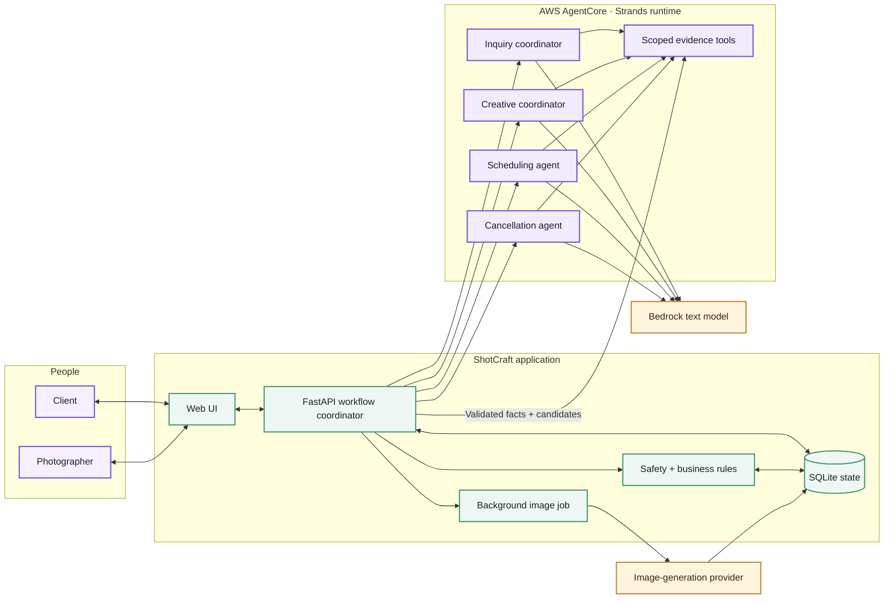

# ShotCraft

### From “I have a photoshoot idea” to “we’re booked.”

ShotCraft is an AI-assisted workspace for photographers and their clients. A client describes the shoot they want; ShotCraft gathers missing details, creates visual direction and a shoot plan, checks the photographer’s calendar, and helps both people agree on a time. When plans change, the same workspace helps negotiate a new slot or review a cancellation—without silently changing a booking.

**Built for the [Agents for Humans Hackathon](https://agentsforhumans.devpost.com/) · Professional Agents track.**

> **The idea:** Let the agent do the repetitive preparation and checking. Bring the photographer and client in when a creative, scheduling, or cancellation decision needs a human.

## The problem

Planning one photoshoot can mean scattered messages about style, wardrobe, location, deliverables, availability, and contingencies. The photographer then has to turn those details into a workable plan, compare calendars, propose times, and repeat much of the process when something changes. ShotCraft keeps that work in one place and makes the next step explicit for each person.

## A shoot, from start to finish

1. **Client sends an inquiry.** They describe the concept, requested date, preferred time windows, duration, budget, and other details.
2. **ShotCraft fills the gaps.** A Strands-backed intake step identifies missing information and asks targeted follow-up questions.
3. **The creative direction takes shape.** A tool-using Strands coordinator reads the inquiry and follow-up history, invokes brief and moodboard specialists, and saves each artifact as it finishes. A separate image-generation provider renders the visual references; the shoot plan is then drafted for photographer review.
4. **The photographer reviews the plan and times.** A tool-using Strands scheduling agent reads the shoot context and confirmed bookings, asks a deterministic availability tool for duration-matched options, and ranks safe candidates. The photographer can edit the plan and choose what to send.
5. **The client confirms.** They review the plan and time options, accept the displayed cancellation policy, and select a time. Availability is checked again before the booking is saved.
6. **Changes stay coordinated.** A client can request a new date/time preference or cancellation. The booking stays intact while Strands prepares a review and the photographer decides what to do next.

## Where Strands does real work

ShotCraft uses the **Strands Agents SDK** with Amazon Bedrock’s OpenAI-compatible endpoint for text reasoning. It is not just a chat box: the scheduling and cancellation agents call scoped, read-only tools to gather facts before recommending an action.

| Agent step | What it reads or produces | Human handoff |
| --- | --- | --- |
| Inquiry and creative planning | Analyzes missing details; a Strands coordinator calls tools to read context, review follow-ups, create the brief, and plan the moodboard | Photographer edits and approves the creative plan |
| Scheduling and time changes | Calls tools for shoot context, confirmed bookings, available slots, and prior preference rounds; ranks up to three validated options | Photographer reviews options before sending; client selects one |
| Cancellation review | Calls tools for the confirmed booking, accepted policy, client reason, and project history; suggests an action and editable message | Photographer approves, declines, or messages first |

The agent **does not invent available times, book a shoot, calculate or collect a fee, or cancel a booking on its own**. Python availability checks apply a 30-minute buffer around confirmed shoots. Only validated options can be shared, and the chosen slot is rechecked at confirmation. Cancellation fee and refund figures come from server-side policy logic; they are guidance in this app, not a payment transaction.

If the preferred time window is full, ShotCraft looks for later free slots on the **same date** and labels them as outside the preferred window. If no duration-matched slot is available that day, it asks for another date instead of presenting a conflict. If agent ranking is unavailable, deterministic calendar-checked options can still be shown for photographer review and the UI identifies the fallback.

## Architecture

ShotCraft has one durable backend, two AI providers, and a clear **decision boundary**. FastAPI records each workflow stage and runs long-lived image jobs. Strands coordinates creative specialists and scheduling/cancellation tool loops. Deterministic code checks commitments before anything changes.



The shortest way to read the diagram is: people make decisions in the UI, FastAPI owns durable state and sends bounded evidence to AgentCore, Strands recommends next steps through scoped tools, and deterministic rules protect bookings before anything is committed.

**What happens inside the loop:**

1. **A real event starts the work.** An inquiry, follow-up, time-change request, or cancellation request reaches FastAPI. The backend saves it and advances the project’s workflow state.
2. **Strands gathers context and recommends.** For scheduling, its tools read the requested duration/window, confirmed bookings, candidate slots, and—when rescheduling—previous preference rounds. For cancellation, they read the booking, accepted policy, reason, and project history. The agent returns a structured recommendation, not a database write.
3. **Code enforces the boundary.** Availability generation and overlap checks use Python with a 30-minute booking buffer. Proposed slot IDs must match generated candidates; the client’s selected slot is revalidated before confirmation. Cancellation amounts are calculated by policy code, not by the model.
4. **People make commitments.** The photographer reviews and shares a plan or time options, and the client selects a slot. A cancellation remains pending until the photographer approves or declines it; messaging first does not release the booking.

**State and recovery.** SQLite stores inquiry facts, creative artifacts, schedule proposals, confirmed bookings, conversations, agent-review results, and a visible workflow history. Project pages poll for updates. Generated images live in `static/generated/` for this demo; a stopped moodboard render can be retried from the saved brief. The image provider is separate from Strands: Strands plans the visual direction, then the provider renders it. There is no payment-processing integration.

## Try the demo locally

**Prerequisites:** Python 3.11+, an Amazon Bedrock API key for the configured text model, and an OpenAI API key for moodboard image generation. The text and image providers are separate; both are needed for the full inquiry-to-moodboard demo. Run the following from the repository root.

```bash
python3 -m venv .venv
source .venv/bin/activate
pip install -r requirements.txt
cp .env.example .env
```

Set these values in `.env` (never commit real keys):

```dotenv
AWS_REGION=us-west-2
AWS_BEARER_TOKEN_BEDROCK=your_bedrock_api_key
SHOTCRAFT_MODEL=openai.gpt-oss-120b-1:0
OPENAI_API_KEY=your_openai_api_key
SHOTCRAFT_IMAGE_MODEL=gpt-image-2.5-flare
SHOTCRAFT_AGENTCORE_ENABLED=true
SHOTCRAFT_AGENTCORE_RUNTIME_ARN=arn:aws:bedrock-agentcore:us-west-2:ACCOUNT_ID:runtime/RUNTIME_ID
```

Your Bedrock account must have access to the selected text model, and your image-provider account must have access to the configured image model. Override `SHOTCRAFT_BEDROCK_ENDPOINT` or either model ID if your environment uses different compatible endpoints/models.

Start the app:

```bash
uvicorn app.main:app --reload --host 127.0.0.1 --port 8000
```

Open [http://localhost:8000](http://localhost:8000). Create one **photographer** account and one **client** account. Use separate browser profiles or sign out between roles. A quick provider check is available with `python smoke_test.py`; `/healthz` checks that the web service is running but does not test model credentials.

### Five-minute judge walkthrough

1. As the **client**, submit an inquiry for a 60-minute shoot with a date and a broader preferred window. Complete any follow-up questions.
2. As the **photographer**, open the project. Watch the planning progress, review the rendered moodboard and editable shoot plan, and inspect the scheduling checks and proposed one-hour slots.
3. Share the plan and up to three time options. As the **client**, review the plan, accept the cancellation policy, and choose one option.
4. As the **client**, request a time change with new date/window preferences. As the **photographer**, review the protected current booking and conflict-free alternatives before sending them. Accept one as the client to update the shoot.
5. For the exception path, request cancellation on a scheduled shoot. As the photographer, open the Strands cancellation review, inspect the recommendation and policy guidance, then **message first**, **approve**, or **decline**. Messaging keeps the request pending; approval releases the calendar slot.

Image generation can take a few minutes. If the provider interrupts it, the project offers a retry using the saved brief rather than requiring a new inquiry.

## Verify the implementation

The automated tests cover schedule conflicts and alternative windows, repeated time-change rounds, cancellation decisions, and moodboard recovery. They use temporary SQLite databases and mocked provider calls; a live model run is a separate check.

```bash
python -m unittest discover -s tests
python smoke_test.py                 # live Bedrock/Strands credential check
python verify_strands_creative.py    # live creative tool loop; no DB writes or images
python verify_strands_scheduling.py  # live free-window and conflicting-booking tool loops; no DB writes
```

The live verifiers must print `agent_used_tools: true`. They fail if Strands falls back, skips a required tool, or proposes a conflicting slot. They prove agent tool execution and calendar-safe suggestions, **not** photographer sharing or client confirmation; complete those human steps in the judge walkthrough. The model calls may incur provider charges.

For a deployed instance, see the [EC2 runbook](deploy/EC2.md). It describes the FastAPI/Nginx setup, secrets, and data persistence. A live deployment is optional for local evaluation.

## Project map

| Path | Purpose |
| --- | --- |
| [`app/agent.py`](app/agent.py) | Strands agents, model calls, and tool-using scheduling/cancellation reviews |
| [`app/main.py`](app/main.py) | FastAPI routes and planning workflow orchestration |
| [`app/storage.py`](app/storage.py) | SQLite persistence, booking state, messages, and history |
| [`app/images.py`](app/images.py) | Moodboard image rendering and retry behavior |
| [`static/`](static/) | Client and photographer browser workspaces |
| [`tests/`](tests/) | Workflow and regression tests |

**Why it matters:** a photographer spends less time reconciling forms, messages, and calendars, while a client gets a clear path from idea to confirmed shoot. ShotCraft makes the agent’s work visible—but reserves the meaningful commitments for people.
